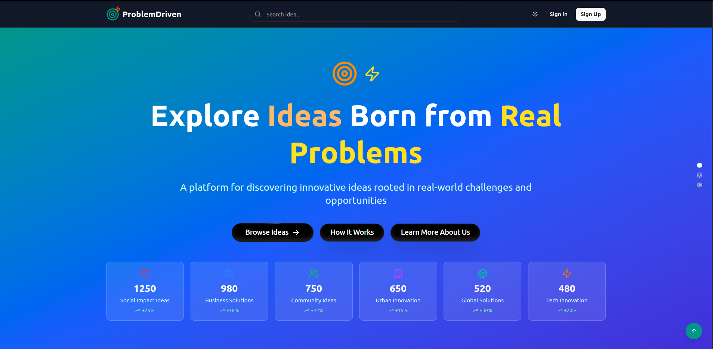
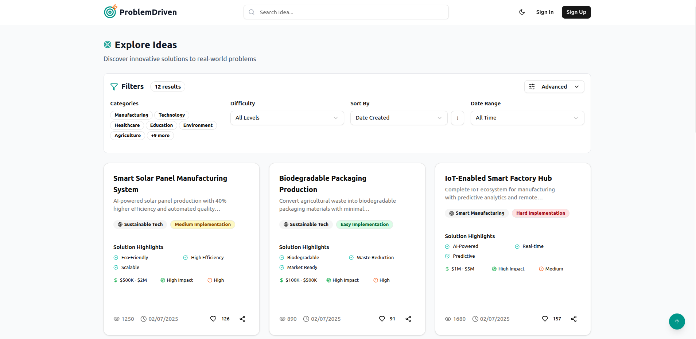

# 🎯 ProblemDriven - AI-Powered Problem-Solution Marketplace [[LIVE DEMO](https://problemdriven.vercel.app/)]

 [](https://typescriptlang.org)    

**ProblemDriven** is a revolutionary platform that transforms problems into opportunities through innovative business solutions. Built with Next.js 15, MongoDB, and Google Gemini AI to connect problem solvers with real-world challenges.

> *"Every problem is an opportunity in disguise. ProblemDriven helps you see the solution."*

## 📸 Application Screenshots




*Homepage showcasing the problem-solution marketplace with AI-powered search and category navigation*


*User dashboard displaying solution cards, impact metrics, and activities*

## ✨ Platform Vision

**ProblemDriven** is more than just a marketplace - it's a movement that empowers change-makers to identify, analyze, and solve the world's most pressing problems through innovative business solutions.

### 🎯 Core Mission
- **Problem Identification**: Discover and catalog social, community, and business challenges
- **Solution Marketplace**: Connect problems with innovative business solutions  
- **Strategic Analysis**: AI-powered insights for problem-solution matching
- **Impact Measurement**: Track real-world impact of implemented solutions

## 🚀 Key Features

### 🎯 Problem-Solution Engine
- **10,000+ Problem-Solution Pairs** - Curated database of real-world challenges and business solutions
- **AI-Powered Matching** - Google Gemini AI for intelligent problem-solution discovery
- **Smart Recommendations** - Personalized suggestions based on user interests and expertise
- **Interactive Solution Cards** - Rich visual presentation with impact metrics, feasibility scores, and implementation guides

### 🌍 Problem Categories
- **Social Impact Solutions** - Addressing community welfare, education, healthcare
- **Business Growth Challenges** - Operational efficiency, market expansion, innovation gaps
- **Community Issues** - Local problems requiring grassroots business solutions
- **Urban Solutions** - Smart city challenges and sustainable development
- **Global Challenges** - Climate change, poverty, inequality through business innovation
- **Innovation Gaps** - Technology and process improvements for existing problems

### 👤 User Experience
- **Freemium Model** - 6 free solution views, then subscription for unlimited access
- **Problem Solver Dashboard** - Profile management, saved solutions, impact tracking
- **Impact Points System** - Engagement rewards and gamification for solution contributors
- **AI Solution Assistant** - Interactive help and personalized recommendations
- **Community Features** - Rate, share, and collaborate on solutions

## 🛠️ Tech Stack

### Frontend
- **Next.js 15** - React framework with App Router
- **React 19** - Latest React with concurrent features
- **TypeScript 5** - Type-safe development
- **Tailwind CSS 4** - Utility-first CSS framework with custom ProblemDriven theme
- **shadcn/ui** - Modern UI component library
- **Lucide React** - Beautiful icons (Target, Zap, Users, etc.)
- **Framer Motion** - Smooth animations and transitions

### Backend & Database
- **Node.js** - Runtime environment
- **MongoDB** - NoSQL database with Mongoose ODM
- **REST APIs** - Clean API architecture for problem-solution management
- **Google Gemini AI** - AI-powered problem analysis and solution matching

### Authentication & Security
- **Clerk** - Complete authentication solution with JWT validation
- **Middleware Protection** - Route-level security
- **User Activity Tracking** - Solution views, engagement metrics, and impact measurement

### Development Tools
- **ESLint 9** - Code linting with custom rules
- **Prettier 3** - Code formatting
- **TypeScript** - Static type checking
- **Next.js Bundle Analyzer** - Bundle optimization
- **Docker** - Containerized deployment

## 📁 Project Structure

```
src/
├── app/                    # Next.js App Router
│   ├── api/               # API routes
│   │   ├── ideas/         # Problem CRUD operations
│   │   ├── categories/    # Problem categories
│   │   ├── user/          # User management
│   │   ├── ai/            # AI problem-solution matching
│   │   ├── chat/          # AI chat functionality
│   │   ├── admin/         # Admin operations
│   │   └── seed/          # Database seeding
│   ├── dashboard/         # User dashboard
│   ├── explore/           # Problem exploration
│   ├── chat/              # AI chat interface
│   ├── blog/              # Blog section
│   ├── research/          # Research section
│   ├── guides/            # Implementation guides
│   ├── sign-in/           # Authentication pages
│   ├── sign-up/           
│   ├── globals.css        # Global styles with ProblemDriven theme
│   ├── layout.tsx         # Root layout
│   └── page.tsx           # Homepage
├── components/            # React components
│   ├── ui/               # shadcn/ui components
│   ├── home/             # Homepage components
│   ├── layout/           # Layout components
│   ├── subscription/     # Subscription components
│   └── ...               # Feature-specific components
├── lib/                  # Utility libraries
│   ├── database.ts       # MongoDB connection
│   ├── gemini.ts         # Google Gemini AI integration
│   ├── userService.ts    # User management service
│   ├── seedData.ts       # Sample problem-solution data
│   └── utils.ts          # General utilities
├── models/               # MongoDB models
│   ├── Problem.ts        # Problem schema
│   ├── Solution.ts       # Solution schema
│   ├── Category.ts       # Category schema
│   └── User.ts           # User schema
├── types/                # TypeScript type definitions
│   └── index.ts          # Shared types
└── hooks/                # Custom React hooks
    └── useSmoothScroll.ts # Smooth scrolling functionality
```

## 🔧 API Endpoints

### Problems & Solutions
- `GET /api/ideas` - Get paginated problems with filters
- `GET /api/ideas/[id]` - Get specific problem
- `POST /api/ideas` - Submit new problem (authenticated users)
- `POST /api/ideas/[id]/rate` - Rate a solution

### Categories
- `GET /api/categories` - Get all problem categories
- `POST /api/categories` - Create new category (admin)

### User Management
- `GET /api/user/stats` - Get user impact statistics
- `POST /api/user/view-solution` - Record solution view
- `POST /api/user/save-solution` - Save/unsave solution

### AI Features
- `POST /api/ai/match-solutions` - AI-powered problem-solution matching
- `POST /api/ai/analyze-problem` - Get AI problem analysis
- `POST /api/chat` - AI chat for problem-solving assistance

### Admin
- `GET /api/admin/stats` - Get platform statistics (admin only)
- `POST /api/admin/moderate` - Content moderation (admin only)

### Utilities
- `POST /api/seed` - Seed database with sample problem-solution data


## 🏁 Getting Started

### Prerequisites

- **Node.js 18+** - Runtime environment
- **MongoDB** - Database (local or cloud)
- **Clerk Account** - For authentication
- **Google Gemini API Key** - For AI features

### Installation

1. **Clone the Repository**:
    ```bash
    git clone <repository-url>
    cd problemdriven-platform
    ```

2. **Install Dependencies**:
    ```bash
    npm install
    # or
    pnpm install
    # or
    yarn install
    ```

3. **Environment Setup**:
   Create a `.env.local` file in the root directory:
    ```env
    # Database
    MONGODB_URI=mongodb://localhost:27017/problemdriven
    
    # Clerk Authentication
    NEXT_PUBLIC_CLERK_PUBLISHABLE_KEY=your_clerk_publishable_key
    CLERK_SECRET_KEY=your_clerk_secret_key
    NEXT_PUBLIC_CLERK_SIGN_IN_URL=/sign-in
    NEXT_PUBLIC_CLERK_SIGN_UP_URL=/sign-up
    NEXT_PUBLIC_CLERK_AFTER_SIGN_IN_URL=/dashboard
    NEXT_PUBLIC_CLERK_AFTER_SIGN_UP_URL=/dashboard
    
    # Google Gemini AI
    GOOGLE_GEMINI_API_KEY=your_google_gemini_api_key
    
    # App Configuration
    NEXT_PUBLIC_APP_URL=http://localhost:3000
    FREE_VIEW_LIMIT=6
    ```

4. **Start Development Server**:
    ```bash
    npm run dev
    ```

5. **Seed the Database** (optional):
    ```bash
    npm run db:seed
    ```

The application will be available at `http://localhost:3000`

### Build for Production

```bash
npm run build
npm start
```

## 🐳 Docker Deployment

### Using Docker

```bash
docker build -t problemdriven .
docker run -p 3000:3000 problemdriven
```

### Using Docker Compose

```yaml
version: '3.8'
services:
  app:
    build: .
    ports:
      - "3000:3000"
    environment:
      - MONGODB_URI=mongodb://mongo:27017/problemdriven
    depends_on:
      - mongo
  
  mongo:
    image: mongo:latest
    ports:
      - "27017:27017"
    volumes:
      - mongo_data:/data/db

volumes:
  mongo_data:
```

## 🚀 Deployment

### Vercel (Recommended)
1. Connect your GitHub repository to Vercel
2. Add environment variables in Vercel dashboard
3. Deploy automatically on push to main branch

### Manual Deployment
```bash
npm run build
npm start
```

## 💡 Business Model

### Freemium Structure
- **Free Tier**: 6 solution views per day
- **Premium Tier**: Unlimited access + advanced features
- **Impact Points**: Engagement rewards system
- **Community Features**: Rate, share, collaborate on solutions

### Premium Features
- Unlimited solution access
- AI-powered problem analysis
- Save favorite solutions
- Advanced search and filtering
- Priority support
- Exclusive solution content
- Direct connection with solution implementers

## 🔒 Authentication Flow

1. **User Registration/Login** - Handled by Clerk
2. **JWT Token Generation** - Automatic with Clerk
3. **API Route Protection** - Middleware validates tokens
4. **Problem Solver Profile Creation** - Auto-created on first login
5. **Solution View Tracking** - Monitors free view usage

## 🧪 Development

### Running Tests
```bash
npm test
```

### Code Quality
```bash
npm run lint
npm run format
```

### Database Seeding
```bash
npm run db:seed
```

## 📊 Analytics & Impact Tracking

The platform includes comprehensive analytics for:
- Problem identification trends
- Solution effectiveness metrics
- User engagement and impact
- Success story tracking
- Community collaboration metrics

## 🤝 Contributing

We welcome contributions from problem solvers worldwide:

1. Fork the repository
2. Create a feature branch
3. Make your changes
4. Add tests if applicable
5. Submit a pull request

## 📄 License

This project is licensed under the MIT License - see the [LICENSE](LICENSE.md) file for details.

## 🆘 Support

For support and questions:
- Create an issue on GitHub
- Contact our problem-solving team
- Join our community discussions
- Check the documentation

---

**Built with ❤️ by problem solvers, for problem solvers worldwide**

Connect with developer : [https://nrknavin.com](https://www.nrknavin.com)

*"Every problem is an opportunity in disguise. ProblemDriven helps you see the solution."*
